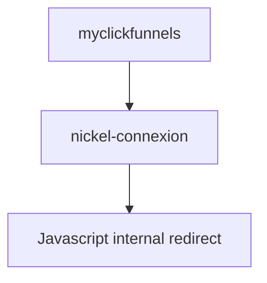

# **Nickel Phishing Report —** **myclickfunnels.com → phishing page**
**Date:** 2025-08-02

**Campaign Overview:**
This is the second phishing email received, crafted more carefully than the first. The earlier campaign used phpList and was quickly taken down. However, the final phishing page is still live.

## **Relevant Email Headers**

**Return-Path:** `0986763rat9378@intnet.mu`
> Belongs to a Mauritius-based ISP (intnet.mu), possibly owned by Orange Telecom.

**Received:** from iron1.emtelworld.com (196.192.81.95)
> A telecom server in Mauritius; may suggest either abuse of local infra or spoofing.

**Authentication Results:**
- **SPF:** fail — the IP 196.192.81.95 is _not authorized_ to send mail on behalf of intnet.mu  
- **DKIM:** none — no DKIM signature detected  
- **DMARC:** fail — domain publishes DMARC with p=none, so no action is enforced

```bash
dig txt _dmarc.intnet.mu +short
"v=DMARC1; p=none; sp=quarantine; ruf=mailto:mailauth-reports@myt.mu; rua=mailto:mailauth-reports@myt.mu;"
```
> A DMARC policy exists, but does not enforce any action on main domain spoofing.
> Subdomain policy (sp=quarantine) is stricter — this may be a misconfiguration.
> The lack of SPF and DKIM makes spoofing trivially possible.

### **DNS Observations on** **intnet.mu**

```bash
dig txt intnet.mu +short
;; Warning: Message parser reports malformed message packet.
"yahoo-verification-key=pVwRC51Epfk7gs2pM6QLJlApMrfwT2KWBeOOczIWrUw="
"test_check_12_05_09_55"
"google-site-verification=VrD2LdihzbttZCnZCVeZTv61-IC7p3bAjd3O2HzmgRc"
"google-site-verification=A9NRmTRTmif3SMsVuzIZyjuqHiQSfHYtWWZBYho9bdM"
"globalsign-domain-verification=MaeCGDjLB0b7a_J3bW3vVkNxkEfkPXNjOTlzWArrmh"
"_globalsign-domain-verification=gDdXnC8x0UNoTBnsQszUY9xeJJSHYu6UC3GgGvE2IO"
```

The TXT records include multiple **legacy or test verification entries**, including:
-  Duplicate Google site verifications   
-  A mysterious test_check_12_05_09_55 entry
-  GlobalSign tokens, some of which appear malformed

 > These signs suggest **poor DNS hygiene**, especially odd for a telecom provider.

## **Header Anomalies**

`Received`: from unknown (HELO 91.227.41.126) (102.160.176.89)
> The SMTP client claimed HELO as 91.227.41.126. 
 
> I have trouble understanding what is going on here. I need to work on this.

From: compte-nickel.fr `0986763rat9378@intnet.mu`
To: `compte@nickel.fr`, `0986763rat9378@intnet.mu`
> This is **not a bounce message** — it’s crafted to appear like a legit Nickel internal alert.

> The pairing of nickel.fr in the To: and From: headers is likely intended to confuse spam filters and simulate internal banking communication.

### **Assessment** 

The scam likely abuses:
- A **misconfigured telecom domain** with DMARC but no SPF/DKIM
- Amateurish but **deliberately spoofed headers**
- And **intentionally poisoned DNS TXT records** or leftovers

Despite technical gaps, the phishing attempt was delivered — likely due to iCloud/Apple’s lenient interpretation of DMARC p=none ?

Original Mail:
![[Nickel_2_rawEmaol.txt]]

---

## Redirect Chain

1. Original phish link: `https://medsesteamworkspace.myclickfunnels.com/app`
   - 302 -
2. Redirects to : `https://nickel-connexionapplication.ls-kws.de/-/redirect`
```bash
<script type="text/javascript">
		// Simulate a mouse click:
		window.location.href = "./embed?url=" + btoa("https://nickel-connexionapplication.ls-kws.de/-//cache/EwWLidqjkwJjXFRt?" + decodeURI(window.location.hash.substr(1)).replace(/\s/g, ''));
	</script>
```

> attempt to obfuscate the redirection. 
> The page body is empty, there is no `<noscript>` tag. This is an obvious trap! lets jump right in


last stable: `https://nickel-connexionapplication.ls.kws.de/-//cache/EwWLidqjkwJjXFRt?op=a`




> Cleave.js is used with the deprecated version. 
> Could again maybe poison the lib this to get to the actors

![[Screenshot 2025-08-02 at 10.40.09.png]]

---
## Infrastructure and recon

Page source : ![[nickel2_rawSourceCached.txt]]
```javascript
var checkInterval = setInterval(function() {

var xhr = new XMLHttpRequest();

xhr.open('GET', 'https://nickel-connexionapplication.ls-kws.de/-/session.php?session_id=aa0df9c95262f80a2435a82162814aee', true);

xhr.onload = function() {

if (xhr.status === 200) {

var response = JSON.parse(xhr.responseText);

if (response.redirect === true) {

var updateXhr = new XMLHttpRequest();

updateXhr.open('GET', 'https://nickel-connexionapplication.ls-kws.de/-/callback.php?session_id=aa0df9c95262f80a2435a82162814aee&redirect=false&url=', true);

updateXhr.onload = function() {

if (updateXhr.status === 200) {

window.location = atob(response.url);

} else {

console.error('Failed to update session: ' + updateXhr.status);

}

};

updateXhr.send();

}

} else {

console.error('Session check failed: ' + xhr.status);

}

};

xhr.send();

}, 3000); // Checks every second

```

> The phishing page includes a looping JavaScript function that polls a backend endpoint (/session.php) every 3 seconds. If the server replies with a redirect: true flag, a secondary request is sent to /callback.php, and the victim is then redirected to a base64-decoded URL via window.location. This approach allows the attacker to monitor live sessions and control victim redirection dynamically, which is often used to delay redirection until an operator is ready or a proxy is active. It also obscures the final payload URL from static inspection.

Submitting the form serves:
![[nickel2_rawSource_endphishMaybe.txt]]

As usual lets look at a curl with a fake UA:

```bash
curl -A "Mario" -I "https://nickel-connexionapplication.ls-kws.de/-//cache/EwWLidqjkwJjXFRt?op=b"
HTTP/2 500
content-location: EwWLidqjkwJjXFRt.php
vary: negotiate,User-Agent
tcn: choice
expires: Thu, 19 Nov 1981 08:52:00 GMT
cache-control: no-store, no-cache, must-revalidate
pragma: no-cache
set-cookie: PHPSESSID=476051ed3274941ccb389beeb0a4eee3; path=/
content-type: text/html
date: Sat, 02 Aug 2025 09:58:39 GMT
server: Apache
```
> Looks like the phishing infrastructure uses Apache with legacy mod_negotiation enabled, dynamically selecting content based on the User-Agent and Accept headers. 
> Requests to paths like /-//cache/... result in 500 errors when sent with custom User-Agent strings (e.g. “Mario”), suggesting fragile routing logic or improperly handled content negotiation. The content-location header reveals PHP-based routing (.php files), and the presence of PHPSESSID cookies confirms server-side session tracking.

```bash
curl -I "https://nickel-connexionapplication.ls-kws.de/-//cache/EwWLidqjkwJjXFRt?op=b"
HTTP/2 403
content-location: EwWLidqjkwJjXFRt.php
vary: negotiate,User-Agent
tcn: choice
expires: Thu, 19 Nov 1981 08:52:00 GMT
cache-control: no-store, no-cache, must-revalidate
pragma: no-cache
set-cookie: PHPSESSID=b70dcf92baccec11509588bbaf2355e5; path=/
content-type: text/html
date: Sat, 02 Aug 2025 10:00:18 GMT
server: Apache
```
> This looks like hardcoded logic, lets see with a real UA

Trying various legitimate UA, the server returns 500.
I guess there is a logic with UA blacklist, but for the server to not crash, a token ID or a cookie is needed.

```bash
curl -v -I --compressed \
  -A "Cookie Monster" \
  -H "Cookie: PHPSESSID=0cf1ed1ba7417d9e760faa0cbb9facab" \
  "https://nickel-connexionapplication.ls-kws.de/-//cache/EwWLidqjkwJjXFRt?op=b"
* Host nickel-connexionapplication.ls-kws.de:443 was resolved.
* IPv6: (none)
* IPv4: 85.13.164.177
*   Trying 85.13.164.177:443...
* Connected to nickel-connexionapplication.ls-kws.de (85.13.164.177) port 443
* ALPN: curl offers h2,http/1.1
* (304) (OUT), TLS handshake, Client hello (1):
*  CAfile: /etc/ssl/cert.pem
*  CApath: none
* (304) (IN), TLS handshake, Server hello (2):
* (304) (IN), TLS handshake, Unknown (8):
* (304) (IN), TLS handshake, Certificate (11):
* (304) (IN), TLS handshake, CERT verify (15):
* (304) (IN), TLS handshake, Finished (20):
* (304) (OUT), TLS handshake, Finished (20):
* SSL connection using TLSv1.3 / AEAD-CHACHA20-POLY1305-SHA256 / [blank] / UNDEF
* ALPN: server accepted h2
* Server certificate:
*  subject: CN=nickel-connexionapplication.ls-kws.de
*  start date: Jul 30 21:54:38 2025 GMT
*  expire date: Oct 28 21:54:37 2025 GMT
*  subjectAltName: host "nickel-connexionapplication.ls-kws.de" matched cert's "nickel-connexionapplication.ls-kws.de"
*  issuer: C=US; O=Let's Encrypt; CN=E6
*  SSL certificate verify ok.
* using HTTP/2
* [HTTP/2] [1] OPENED stream for https://nickel-connexionapplication.ls-kws.de/-//cache/EwWLidqjkwJjXFRt?op=b
* [HTTP/2] [1] [:method: HEAD]
* [HTTP/2] [1] [:scheme: https]
* [HTTP/2] [1] [:authority: nickel-connexionapplication.ls-kws.de]
* [HTTP/2] [1] [:path: /-//cache/EwWLidqjkwJjXFRt?op=b]
* [HTTP/2] [1] [user-agent: Cookie Monster]
* [HTTP/2] [1] [accept: */*]
* [HTTP/2] [1] [accept-encoding: deflate, gzip]
* [HTTP/2] [1] [cookie: PHPSESSID=0cf1ed1ba7417d9e760faa0cbb9facab]
> HEAD /-//cache/EwWLidqjkwJjXFRt?op=b HTTP/2
> Host: nickel-connexionapplication.ls-kws.de
> User-Agent: Cookie Monster
> Accept: */*
> Accept-Encoding: deflate, gzip
> Cookie: PHPSESSID=0cf1ed1ba7417d9e760faa0cbb9facab
>
* Request completely sent off
< HTTP/2 200
HTTP/2 200
< content-location: EwWLidqjkwJjXFRt.php
content-location: EwWLidqjkwJjXFRt.php
< vary: negotiate,Accept-Encoding,User-Agent
vary: negotiate,Accept-Encoding,User-Agent
< tcn: choice
tcn: choice
< expires: Thu, 19 Nov 1981 08:52:00 GMT
expires: Thu, 19 Nov 1981 08:52:00 GMT
< cache-control: no-store, no-cache, must-revalidate
cache-control: no-store, no-cache, must-revalidate
< pragma: no-cache
pragma: no-cache
< content-type: text/html
content-type: text/html
< date: Sat, 02 Aug 2025 10:05:54 GMT
date: Sat, 02 Aug 2025 10:05:54 GMT
< server: Apache
server: Apache
<

* Connection #0 to host nickel-connexionapplication.ls-kws.de left intact
```


> The phishing backend requires a valid PHP session cookie (PHPSESSID=...) to serve any content. Without this, requests are blocked (403) for specific UA ( like CURL ) or cause server errors (500).
>  Interestingly, the backend accepts arbitrary User-Agent strings unless explicitly blocked, as demonstrated by successful access using User-Agent: Cookie Monster. 
>  This confirms the site uses weakly validated session gating rather than robust authentication. 
>  TLS inspection reveals a Let’s Encrypt certificate issued just days ago, suggesting recent deployment. The misuse of Apache’s content negotiation headers (tcn: choice) appears to be an attempt at legitimacy or to confuse scanners.

```bash
echo | openssl s_client -connect nickel-connexionapplication.ls-kws.de:443 -servername nickel-connexionapplication.ls-kws.de 2>/dev/null \
| openssl x509 -noout -subject -issuer -dates -serial -ext subjectAltName
subject=CN=nickel-connexionapplication.ls-kws.de
issuer=C=US, O=Let's Encrypt, CN=E6
notBefore=Jul 30 21:54:38 2025 GMT
notAfter=Oct 28 21:54:37 2025 GMT
serial=06BD565CA90DFB0BE1F1EE5B969371E37E70
X509v3 Subject Alternative Name:
    DNS:nickel-connexionapplication.ls-kws.de, DNS:www.nickel-connexionapplication.ls-kws.de
```
> Very new ( 3 days old )

FWIW:
```bash
dig TXT ls-kws.de +short
"v=spf1 mx a ?all"
```
```bash
dig TXT _dmarc.ls-kws.de +short
"v=DMARC1; p=none;"
```
> Maybe the phishing kit automatically registers poor email config so they can spam. But this makes no sense

Running various different NMAP, ended finding:
```bash
61900/tcp open  unknown              syn-ack ttl 64
62078/tcp open  iphone-sync          syn-ack ttl 64
```

```bash
nc -vz 85.13.164.177 62078
Connection to 85.13.164.177 port 62078 [tcp/*] succeeded!
```
Many ports are open.
Either it is obfuscation / noise with real service running, or a honeypot.
There is a ssl on 443

> This infrastructure is not a passive honeypot: it delivers live payloads, tracks session cookies, and uses real domains with TLS. The server exposes misleading open ports, but behind that lies a functioning phishing kit targeting Nickel users.
> The presence of the Apple iphone-sync port (62078/tcp) is likely due to misconfigured or repurposed infrastructure. The combination of user-agent filtering, session gating, and dynamic JavaScript redirection suggests the operators are technically capable but working with recycled or poorly maintained systems.

---
## Reported to `abuse@all-inkl.com & support@all-inkl.com` with CERT-FR and Nickel in CC,  with raw email, and findings. - 2025-08-02 -