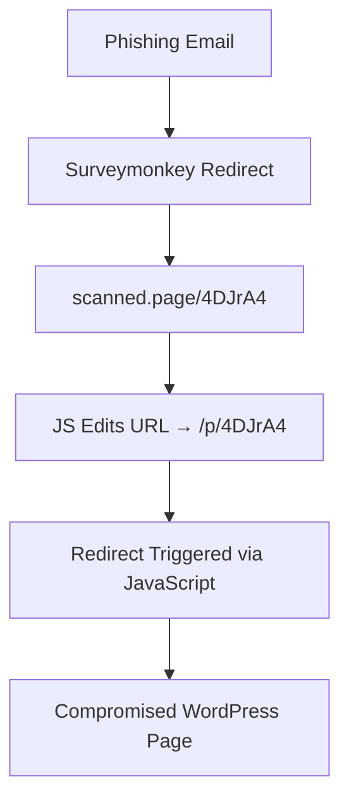

# ANTAI Phishing Report — Campaign 1: "Mail - survey Monkey - -> Compromised Worpress" 

### Impersonating **ANTAI** - **Agence National de Traitement Automatique des Infractions**.

Well crafted [email](evidence/scamAntai_Raw_email.txt)

---
# Relevant Email headers

Return-Path: `hr.surveymonkeyuser.com`

> mail address when email is bounced, also used for SPF

Received: `mta-81-47.sparkpostmail.com`

Apple X-ICL-Score: `2.33303302423`

X-ARC-Info: `policy=fail; arc=none`

> **Authenticated Received Chain**

> Email authentication standard that **preserves original authentication results across intermediaries**, like forwarding or mailing list systems.  

envelope-from : `survey-noreply@hr.surveymonkeyuser.com`
`with ESMTPSA (cipher=AES-256-GCM)`
> **sender was authenticated and encrypted** when talking to SparkPost. It wasn’t some unauthenticated SMTP injection — it used **credentials/API keys**  

Message-ID: `D8.00.32687.D7187886@i-0eaa7758290676f71.mta2vsmtp.sd.prd.sparkpost`
> Likely auto-generated by the **sending MTA** (here, SparkPost’s mta2vsmtp) for logs -> usefull to report, surely they can track back to the real sender / user

Reply-To: `antai-amende-action-requise@notification.freshdesk.com`

---
# Redirect Chain

Launching burp to see what the link is doing:

1. Original Link from Email: `https://www.surveymonkey.com/tr/v1/te/lV6wyxT2Hrg9DiFPsI5vy9HIQc46W4c766FdVmcDRl54XKxhCSZ6E2H0yJiYcG3lw_2FxyLeDFcB6_2BmkC9vjxfde_2BEOgXGaqdGvp64n35mBTd6YWZL_2FQ9ZersT8pkCT83uljEw4lRZHmBPgJDHdAx_2Bhd8LSMKGLHxhOeeI7tmD1U4_3D`

2. Redirects to: `https://scanned.page/4DJrA4`
	- ( Block using burp, likely javascript editing the url -> no js-> You are blocked) Likely using a cloudflare challenge? no sure

3. Javascript redirect: `https://scanned.page/p/4DJrA4`
   
4. Last and definitive email `https://inmacol.mitiendaonline.com/-/KABA/infospage.php???YUTDGIUHSFDJKSDQGFYIUSDTFKJ`
	- Cloudflare challenge, with a the recaptcha or whatever
	- Too noob with burp, can t pass the ultimate cloudflare stupid challenge.
	- Revert to firefox

`https://inmacol.mitiendaonline.com` looks like a legit spanish e-commerce website.

Maybe compromised by a wordpress plugin?



> The phishing page hotlinks official resources from www.amendes.gouv.fr, including banners and logos. This strengthens the illusion of legitimacy and could allow pixel-perfect replication of the real site UI.

[ChromeDevTool Screenshot](evidence/Screenshot-2025-07.png)

[Page source](evidence/LastRedir.html)

---
# Infrastructure / Recon

One POST is made to ip:
`102.165.14.4:5000`

> Data exfiltration occurs via a raw IP over port 5000 — likely a Flask app with no HTTPS. This is amateur-grade infrastructure, suggesting a kit meant for rapid deployment and abandonment.

> Fails because it uses mixed content (http://)

> Correction:

``` html

> curl -i http://102.165.14.4:5000/admins

HTTP/1.1 404 NOT FOUND

Server: TwistedWeb/24.3.0

Date: Mon, 28 Jul 2025 16:42:59 GMT

Content-Type: text/html; charset=utf-8

Content-Length: 207

<!doctype html>

<html lang=en>

<title>404 Not Found</title>

<h1>Not Found</h1>

<p>The requested URL was not found on the server. If you entered the URL manually please check your spelling and try again.</p>

```

**It is a TwistedWeb Server (Python)**

```bash

nmap -Pn -T4 102.165.14.4

Starting Nmap 7.97 ( https://nmap.org ) at 2025-07-28 18:08 +0100

Stats: 0:00:43 elapsed; 0 hosts completed (1 up), 1 undergoing Connect Scan

Connect Scan Timing: About 99.99% done; ETC: 18:08 (0:00:00 remaining)

Nmap scan report for 102.165.14.4

Host is up (0.13s latency).

Not shown: 993 closed tcp ports (conn-refused)

PORT     STATE SERVICE

135/tcp  open  msrpc

139/tcp  open  netbios-ssn

445/tcp  open  microsoft-ds

3389/tcp open  ms-wbt-server

5000/tcp open  upnp

5001/tcp open  commplex-link

5985/tcp open  wsman

```

This looks either like a compromised old window server, or a honeypot?

Or it is the command of the phishing kit deployed.

Port 5985:

> WSMAN : standard protocol for managing computer systems, devices, and applications using web services.

> Windows server slop for remote power shell

```bash

nmap -A -p5000 102.165.14.4

Starting Nmap 7.97 ( https://nmap.org ) at 2025-07-28 18:21 +0100

Nmap scan report for 102.165.14.4

Host is up (0.16s latency).

  

PORT     STATE SERVICE VERSION

5000/tcp open  http    TwistedWeb httpd 24.3.0

|_http-title: 404 Not Found

|_http-server-header: TwistedWeb/24.3.0

  

Service detection performed. Please report any incorrect results at https://nmap.org/submit/ .

Nmap done: 1 IP address (1 host up) scanned in 10.92 seconds

```

```bash

nmap -p- -A 102.165.14.4

Not shown: 65520 closed tcp ports (conn-refused)

PORT      STATE SERVICE       VERSION

135/tcp   open  msrpc         Microsoft Windows RPC

139/tcp   open  netbios-ssn   Microsoft Windows netbios-ssn

445/tcp   open  microsoft-ds  Microsoft Windows Server 2008 R2 - 2012 microsoft-ds

3389/tcp  open  ms-wbt-server Microsoft Terminal Service

5000/tcp  open  http          TwistedWeb httpd 24.3.0

|_http-server-header: TwistedWeb/24.3.0

|_http-title: 404 Not Found

5001/tcp  open  ssl/http      TwistedWeb httpd 24.3.0

|_http-server-header: TwistedWeb/24.3.0

| ssl-cert: Subject: commonName=telegrambotcheck.duckdns.org

| Subject Alternative Name: DNS:telegrambotcheck.duckdns.org

| Not valid before: 2025-05-05T01:49:29

|_Not valid after:  2025-08-03T01:49:28

|_http-title: 404 Not Found

|_ssl-date: TLS randomness does not represent time

5985/tcp  open  http          Microsoft HTTPAPI httpd 2.0 (SSDP/UPnP)

|_http-title: Not Found

|_http-server-header: Microsoft-HTTPAPI/2.0

47001/tcp open  http          Microsoft HTTPAPI httpd 2.0 (SSDP/UPnP)

|_http-title: Not Found

|_http-server-header: Microsoft-HTTPAPI/2.0

49664/tcp open  msrpc         Microsoft Windows RPC

49665/tcp open  msrpc         Microsoft Windows RPC

49666/tcp open  msrpc         Microsoft Windows RPC

49672/tcp open  msrpc         Microsoft Windows RPC

49673/tcp open  msrpc         Microsoft Windows RPC

49674/tcp open  msrpc         Microsoft Windows RPC

49681/tcp open  msrpc         Microsoft Windows RPC

Service Info: OSs: Windows, Windows Server 2008 R2 - 2012; CPE: cpe:/o:microsoft:windows

Host script results:

| smb-security-mode:

|   authentication_level: user

|   challenge_response: supported

|_  message_signing: disabled (dangerous, but default)

| smb2-time:

|   date: 2025-07-28T18:01:46

|_  start_date: 2025-03-10T08:28:23

| smb2-security-mode:

|   3.1.1:

|_    Message signing enabled but not required

Service detection performed. Please report any incorrect results at https://nmap.org/submit/ .

Nmap done: 1 IP address (1 host up) scanned in 2379.93 seconds

```

Interesting:

```bash
# Host: 102.165.14.4

## Ports:
- 5000/tcp: HTTP (TwistedWeb 24.3.0)
- 5001/tcp: HTTPS (TwistedWeb 24.3.0)

## Cert on :5001:
- CN: telegrambotcheck.duckdns.org
- SAN: telegrambotcheck.duckdns.org
- Issuer: Let's Encrypt
- Valid: May–Aug 2025
```
> using some magic openssl I gather the tls cert and the details, but not much can be made from it. I wonder if authorities can trace the telegram bot

Cert Dump 
 
```bash
openssl s_client -connect 102.165.14.4:5001 </dev/null \
  | sed -n '/-----BEGIN CERTIFICATE-----/,/-----END CERTIFICATE-----/p' \
  > telegrambotcheck.crt`
  
  -> [Cert](evidence/telegrambotcheck.crt) 
  > Read with `openssl x509 -in telegrambotcheck.crt -noout -text
```

Interesting interaction:

```bash
curl -vk -X POST "https://102.165.14.4:5001/receive_token?referrer=loco" \
  -d "token=1' OR 1=1 --"
Note: Unnecessary use of -X or --request, POST is already inferred.
*   Trying 102.165.14.4:5001...
* Connected to 102.165.14.4 (102.165.14.4) port 5001
* ALPN: curl offers h2,http/1.1
* (304) (OUT), TLS handshake, Client hello (1):
* (304) (IN), TLS handshake, Server hello (2):
* (304) (IN), TLS handshake, Unknown (8):
* (304) (IN), TLS handshake, Certificate (11):
* (304) (IN), TLS handshake, CERT verify (15):
* (304) (IN), TLS handshake, Finished (20):
* (304) (OUT), TLS handshake, Finished (20):
* SSL connection using TLSv1.3 / AEAD-CHACHA20-POLY1305-SHA256 / [blank] / UNDEF
* ALPN: server accepted http/1.1
* Server certificate:
*  subject: CN=telegrambotcheck.duckdns.org
*  start date: May  5 01:49:29 2025 GMT
*  expire date: Aug  3 01:49:28 2025 GMT
*  issuer: C=US; O=Let's Encrypt; CN=E6
*  SSL certificate verify ok.
* using HTTP/1.x
> POST /receive_token?referrer=loco HTTP/1.1
> Host: 102.165.14.4:5001
> User-Agent: curl/8.7.1
> Accept: */*
> Content-Length: 18
> Content-Type: application/x-www-form-urlencoded
>
* upload completely sent off: 18 bytes
< HTTP/1.1 200 OK
< Server: TwistedWeb/24.3.0
< Date: Wed, 30 Jul 2025 14:04:37 GMT
< Content-Type: text/html; charset=utf-8
< Content-Length: 34
<
* Connection #0 to host 102.165.14.4 left intact
Invalid token or missing referrer.%
```

They gather user data, then ask for card details.

They do not validate inputs, Card details are not validated.  

On previous tests, when trying to send random post to the card detail, I got IP banned after the first post.


---
# Reported to **cert-fr** with raw email, and findings. - 2025-07-29 - 
