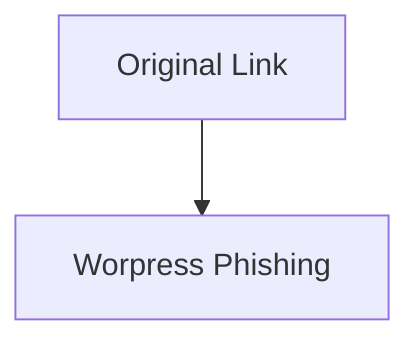

# ANTAI Phishing Report — Campaign 3: "Mail - php list -> Compromised / abandonned Wordpress"
Date: 2025-07-30

### Certainly linked to [this one](1_analysis-report.md)

[Mail](evidence/scamAntai_Raw_email_3.txt) is mediocre, the syntax / vocabulary is ok, but it is terribly crafted.

---

Return-path: `waturlo2kin4@korea.ac.kr`
> Korean university domain

from `TYPPR03CU001.outbound.protection.outlook.com `
> Outlook SMTP ...
> Compromised email?

X-ICL-Score: `3.43204403332`
> Still fails to see the trick, iCloud antiSpam is 100% structural behavior. Clearly they do not read the mail to make decision
> I wonder how much of the score is influence because this is cro$oft

Authentication-Results: 
```text
bimi.icloud.com; bimi=skipped reason=insufficient dmarc
```
> this is insulting

X-ARC-Info: policy=pass; arc=pass; id=mx.microsoft.com 1
> Outlook 

Received-SPF: 
```Text
softfail (spf.icloud.com: domain of transitioning waturlo2kin4@korea.ac.kr does not designate 52.101.126.93 as permitted sender) receiver=spf.icloud.com; client-ip=52.101.126.93; helo=TYPPR03CU001.outbound.protection.outlook.com; envelope-from=waturlo2kin4@korea.ac.kr
```
> SoftFail, sure because it is outlook is *close enough*?
> The SMTP log from iCloud must show some wacky slop from outlook.  

X-DMARC-Info: 
```text
pass=fail; dmarc-policy=none; s=r0; d=r0; pdomain=korea.ac.kr
```
> DMARK is disabled... This makes no sense

From: `Antai waturlo2kin4@korea.ac.kr`

**No** `Reply-to` field.
> maybe outlook SMTP doesn't enforce reply-to?

`Content-Transfer-Encoding: quoted-printable`
> Annoying encoding:
>  `=` -> `=3D`, or `=20` → `space`

> A lot of slop is present in the email because of outlook

---
# Redirect Chain

Launching Burp

1. Original Link from email: `https://itsssl.com/srZIJ`
 > Landing page looks like a *legit* *free* url shortener.
 > It seems to target mostly social network slop.
 > No sign of legal disclaimer to know in what country it operates.

2. Redirects to: `https://grumpy-racoon-2w4xclek.sandboxcms.com/12/infospage.php`
>Looks like another compromised wordpress. 
> I wonder if it is not just a `fake` part of the kit 
  [[#Wordpress might be part of the scam-kit ?]]



[[#Like before the scam is hidden behind a User Agent whitelist.]]

> The website hotlinks *some* assets from `amendes.gouv.fr`
> Blocked because failed CORS
>  
> Same *Modus operandi* as [[Scam1_ANTAI_SurveyMonkey_WP]]
> Compromised / Fakes landing page on a WordPress, and a weird path ending on a phishing endpoint.

[ChromeDevTool Screenshot](evidence/Screenshot_2-2025-07.png)

---
# Infrastructure / Recon

Just like the [[Scam1_ANTAI_SurveyMonkey_WP]], 
There is a POST to 102.165.14.4:5000 (Same as SCAM1)

Same Infra:
```zsh
curl -i http://102.165.14.4:5000

HTTP/1.1 404 NOT FOUND
Server: TwistedWeb/24.3.0
Date: Wed, 30 Jul 2025 10:50:28 GMT
Content-Type: text/html; charset=utf-8
Content-Length: 207
```
The IP will lead to the same result as previously.

On port `5001` doing a cert dump:
```bash
`openssl s_client -connect 102.165.14.4:5001 </dev/null \
  | sed -n '/-----BEGIN CERTIFICATE-----/,/-----END CERTIFICATE-----/p' \
  > telegrambotcheck.crt`
```

-> [Cert](evidence/telegrambotcheck.crt) 
> Read with `openssl x509 -in telegrambotcheck.crt -noout -text`

---
## Wordpress might be part of the scam-kit ?

Lets try to skim the wordpress, I think it is a Fake. 
And then confirm by comparing the previous wordpress scam if it is still up.

Of course the SSL cannot help, since it is a `*.sandboxcms.com` SAN with let's encrypt.
So  sandboxcms guys make the DNS challenge, but scammer are abusing it. 
> *.domain.tld* SANs is a terrible idea when the subdomain is controlled by users.
> At least it is a normal let's encrypt


`https://grumpy-racoon-2w4xclek.sandboxcms.com` -> 200 ( fake) landing page
`/1` to `/11` --> 200 OK, but it is a 404
`/12` -> redirects (`HTTP/2 302 / NGINX`) to `/12/infospage.php`
`/admin` redirects to the normal wp-admin page.

All links are `href=""`, contact, social network etc
There is a single page, and is announcing 900+ followers.

> Turn out it might just be a old / abandoned or test from a random user, and it was exploited, or it was created. I don't see how I could find out
### Lets cross check with [this one](1_analysis-report.md)
Website was `https://inmacol.mitiendaonline.com`

> So, no, this is a real compromised wordpress.

The current `grumpy-racoon-2w4xclek.sandboxcms.com` is not part of the kit.
Must be a *test* of some random user, and it was exposed.
OR part of the kit considering how easy it is.


---
# Scam-Kit Fingerprints (reuse/overlap)

- Hidden form or JS POST to: http://102.165.14.4:5000
- Hotlinks to `amendes.gouv.fr`
- Page structure: single `/12/infospage.php`, dead links, fake followers
- NGINX + HTTP/2 302 + Twisted Web backend

Compare with:  
- [this one](/1_analysis-report.md): same POST IP, same asset hotlinking


## NOTES

## Like before the scam is hidden behind a User Agent whitelist.

```bash
curl -I https://grumpy-racoon-2w4xclek.sandboxcms.com/12/
curl -I -A "DefinitelyNotACurlScript/1.2.3 Beta (Totally a Human)" https://grumpy-racoon-2w4xclek.sandboxcms.com/12/
curl -I -A "python-requests/2.31.0" https://grumpy-racoon-2w4xclek.sandboxcms.com/12/
```
Responds with

```bash
HTTP/2 302
server: nginx
date: Wed, 30 Jul 2025 11:27:08 GMT
content-type: text/html; charset=UTF-8
location: https://www.mediapart.fr/
set-cookie: PHPSESSID=aclbfc8qmt8up2mbur2mf81v73; path=/
expires: Thu, 19 Nov 1981 08:52:00 GMT
cache-control: no-store, no-cache, must-revalidate
pragma: no-cache
x-frame-options: SAMEORIGIN
x-xss-protection: 1; mode=block
x-content-type-options: nosniff
```

But

```bash
curl -I -A "Mozilla/5.0 (Windows NT 10.0; Win64; x64) AppleWebKit/537.36 Chrome/120.0.0.0 Safari/537.36" https://grumpy-racoon-2w4xclek.sandboxcms.com/12/
curl -I -A "Safari" https://grumpy-racoon-2w4xclek.sandboxcms.com/12/
HTTP/2 302
curl -I -A "Mario" https://grumpy-racoon-2w4xclek.sandboxcms.com/12/
HTTP/2 302
```
Respond with:

```bash
HTTP/2 302
server: nginx
date: Wed, 30 Jul 2025 11:24:08 GMT
content-type: text/html; charset=UTF-8
location: infospage.php
set-cookie: PHPSESSID=js8hj84vcvgc2da0id5osvrfp5; path=/
expires: Thu, 19 Nov 1981 08:52:00 GMT
cache-control: no-store, no-cache, must-revalidate
pragma: no-cache
x-frame-options: SAMEORIGIN
x-xss-protection: 1; mode=block
x-content-type-options: nosniff
```

I guess it is some regex based slop like:

```php
$ua = $_SERVER['HTTP_USER_AGENT'];

if (preg_match('/curl|python|bot|scrapy|http/i', $ua)) {
    header("Location: https://www.mediapart.fr/");
    exit;
}
```

Same behavior for [the other one.](1_analysis-report.md)

---

### Interesting interaction:  

```bash
curl -vk -X POST "https://102.165.14.4:5001/receive_token?referrer=loco" \
  -d "token=Payload"
Note: Unnecessary use of -X or --request, POST is already inferred.
*   Trying 102.165.14.4:5001...
* Connected to 102.165.14.4 (102.165.14.4) port 5001
* ALPN: curl offers h2,http/1.1
* (304) (OUT), TLS handshake, Client hello (1):
* (304) (IN), TLS handshake, Server hello (2):
* (304) (IN), TLS handshake, Unknown (8):
* (304) (IN), TLS handshake, Certificate (11):
* (304) (IN), TLS handshake, CERT verify (15):
* (304) (IN), TLS handshake, Finished (20):
* (304) (OUT), TLS handshake, Finished (20):
* SSL connection using TLSv1.3 / AEAD-CHACHA20-POLY1305-SHA256 / [blank] / UNDEF
* ALPN: server accepted http/1.1
* Server certificate:
*  subject: CN=telegrambotcheck.duckdns.org
*  start date: May  5 01:49:29 2025 GMT
*  expire date: Aug  3 01:49:28 2025 GMT
*  issuer: C=US; O=Let's Encrypt; CN=E6
*  SSL certificate verify ok.
* using HTTP/1.x
> POST /receive_token?referrer=loco HTTP/1.1
> Host: 102.165.14.4:5001
> User-Agent: curl/8.7.1
> Accept: */*
> Content-Length: 18
> Content-Type: application/x-www-form-urlencoded
>
* upload completely sent off: 18 bytes
< HTTP/1.1 200 OK
< Server: TwistedWeb/24.3.0
< Date: Wed, 30 Jul 2025 14:04:37 GMT
< Content-Type: text/html; charset=utf-8
< Content-Length: 34
<
* Connection #0 to host 102.165.14.4 left intact
Invalid token or missing referrer.%
```
Can't figure how to go further.  
Tried random wordlist and then some sqli

---

# Reported to **cert-fr** with raw email, and findings. - 2025-07-30 -

