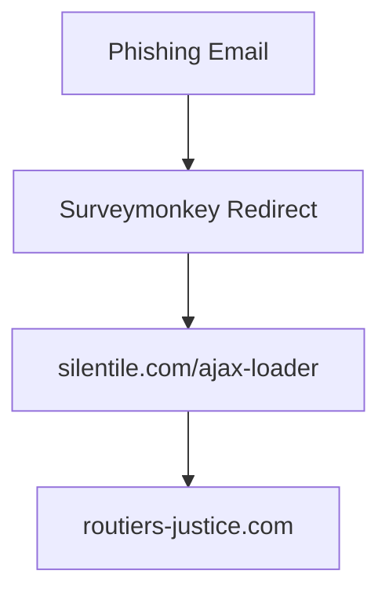

# ANTAI Phishing Report — Campaign 2: "SurveyMonkey -> RoutieresJustice VPS Infiltration"
Date: 2025-07-29

[Email](evidence/ScamAntain_email_4.txt) looks rushed.

---

Return-Path: `survey-noreply@mr.surveymonkeyuser.com`
Received: `mta-81-56.sparkpostmail.com`
> Same `sparkpostmail` trick as the previous [[Scam1_ANTAI_SurveyMonkey_WP]]

Apple X-ICL-Score: 2.33303302423
> Same as the previous one, looks like apple spam filter is solely based on infra and not on content ?

X-ARC-Info: `policy=fail; arc=none`
> Same as before

envelope-from:`survey-noreply@mr.surveymonkeyuser.com`
`with ESMTPSA (cipher=AES-256-GCM) `
> Same as before

Message-ID: `5C.CA.32687.E5898886@i-0eaa7758290676f71.mta2vsmtp.sd.prd.sparkpost`
> Still sparkpost MTA , same as before

Reply-To: `antai.gouv.controle.amendes@routieres-inc.com`

---
# Redirect Chain

1. Original phish link: `https://es.surveymonkey.com/tr/v1/te/zETqGd5fvn44ZigHRJ5K9frpZMPLCnIQ3l0TcjTmeWjNZawuj4GHaRm27JaVgQDILDh9YfyLFRCECnwC3OEjwqv_2FyEDB0Y5pxs_2FcKBSBRJ_2F9rC45INGzOQUOL8inNakTKAw5nANl3nDpsxHMwnRdeKSpRH1Qn_2F9S0FvEMMFACjHDZl3eqeI3XqCZSxCvlMUPPhkqGTbZbc_2BQuNS_2BWbH_2F2A_3D_3D`

2. redirects to: `https://silentile.com/ajax-loader?https://magma.com`
>	For some reason, this redirects to the same url, before redirect elsewhere. 
>	I think this is a missconfig, I see no reason to do so...

3. last and definitive URL: `https://ww2-antai.gouv.amendes.routieres-justice.com/ic-v-R421-9/redirect/?https://vimeo.com/`
	> Javascript challenge. Not the same as before. 
	> Same issue with burp
	> Launching firefox




> The phishing page this time is not pulling ressources from the official website. 
> The website force javascript with AJAX requests every few seconds, or blocks the rendering with a fake loader.

[Chrome DevTool](/evidenceScreenshot_4-2025-07.png)


> The phishing page uses JavaScript-based rendering to delay full DOM construction. Viewing raw source returns a stub HTML — real content is injected via `innerHTML` and hidden within nested `<iframe>`. Static tools like `curl` or Burp fail unless JavaScript is executed.`

But for the source:

```javascript
copy(document.documentElement.outerHTML)
```
Effectively bypasses this.

The post looks weird, I think it is just a beacon to make some sort of analytics, no data is exfiltrate.

They are using two opensource js library:  

`https://github.com/CodeByZach/pace/` -> An automatic web page progress bar.
`https://github.com/nosir/cleave.js` -> to help you format input text content automatically.  
The repo warns it is deprecated...
> Maybe a vector to poison the actors?

The xhr "ping-pong" weird script:  

```javascript
document.addEventListener("DOMContentLoaded", function() {
  var form = document.getElementsByTagName('form')[0];

  form.addEventListener('submit', function(event) {
    event.preventDefault();

    if ($(this).valid()) {
      showWrapper(); // likely shows a fake loading spinner or "processing..." when JS is disabled it triggers it

      $.ajax({
        url: form.action,              // where they POST data
        type: 'POST',
        data: $(this).serialize(),     // form data ?
        success: function(response) {
          // wait 2 seconds, then redirect to "op=b" payload
          setTimeout(function() {
            top.location.href = "https://.../embed?url=...op=b";
          }, 2000);
        },
        error: function(xhr, status, error) {
          // If POST fails, redirect to "op=a" (same endpoint, different flag?)
          top.location.href = "https://.../embed?url=...op=a";
        }
      });
    }
  });
});
```

A form is loaded with JS, like suspected in the first phishing, the form does some fake verification to look legitimate, they are not exfiltrating PII, the card detail is the target.
> Can be found in the page source as #ScriptForm 

Once validated, the form appears, the source code is still "tricky"
But some js timeout and command worked...

The payment form is injected into a nasty nested iFrame...
Opening the iFrame gives the form code.

There is no action data is exfiltrated with AJAX

---

# Infrastructure / Recon

No raw IP, still this is extremely similar.
Too bad I missed the iFrame code on the previous website.

```bash
curl -I "https://ww2-antai.gouv.amendes.routieres-justice.com/ic-v-R421-9/embed?url=aHR0cHM6Ly93dzItYW50YWkuZ291di5hbWVuZGVzLnJvdXRpZXJlcy1qdXN0aWNlLmNvbS9pYy12LVI0MjEtOS8vY2FjaGUvelNPd1FuUGJhdXhqVWxnRD9vcD1i"

HTTP/2 403
server: nginx
date: Tue, 29 Jul 2025 22:27:46 GMT
content-type: text/html; charset=UTF-8
x-powered-by: PHP/7.4.33
expires: Thu, 19 Nov 1981 08:52:00 GMT
cache-control: no-store, no-cache, must-revalidate
pragma: no-cache
set-cookie: PHPSESSID=i5lqchdg9ihpf9gfetgqk9ru9f; path=/
```
Very different here, this looks like a dedicated server.

```bash
dig ww2-antai.gouv.amendes.routieres-justice.com

;; Warning: Message parser reports malformed message packet.
; <<>> DiG 9.10.6 <<>> ww2-antai.gouv.amendes.routieres-justice.com
;; global options: +cmd
;; Got answer:
;; ->>HEADER<<- opcode: QUERY, status: NOERROR, id: 43562
;; flags: qr; QUERY: 1, ANSWER: 1, AUTHORITY: 0, ADDITIONAL: 1

;; OPT PSEUDOSECTION:
; EDNS: version: 0, flags:; udp: 4096
;; QUESTION SECTION:
;ww2-antai.gouv.amendes.routieres-justice.com. IN A

;; ADDITIONAL SECTION:
ww2-antai.gouv.amendes.routieres-justice.com. 736 IN A 195.201.207.38

;; Query time: 6 msec
;; SERVER: 2001:8a0:5622:da00::1#53(2001:8a0:5622:da00::1)
;; WHEN: Tue Jul 29 23:30:07 WEST 2025
;; MSG SIZE  rcvd: 89
```

```bash
nmap -sV -Pn -n 195.201.207.38
Starting Nmap 7.97 ( https://nmap.org ) at 2025-07-29 23:34 +0100
Nmap scan report for 195.201.207.38
Host is up (0.062s latency).
Not shown: 929 filtered tcp ports (no-response), 58 closed tcp ports (conn-refused)
PORT     STATE SERVICE       VERSION
21/tcp   open  ftp           ProFTPD
22/tcp   open  ssh           OpenSSH 9.2p1 Debian 2+deb12u6 (protocol 2.0)
25/tcp   open  smtp          Postfix smtpd
53/tcp   open  domain        (unknown banner: none)
80/tcp   open  http          nginx
106/tcp  open  tcpwrapped
110/tcp  open  pop3          Dovecot pop3d
143/tcp  open  imap          Dovecot imapd
443/tcp  open  ssl/http      nginx
465/tcp  open  ssl/smtp      Postfix smtpd
993/tcp  open  imaps?
995/tcp  open  pop3s?
8443/tcp open  ssl/https-alt sw-cp-server
...
Service Info: Hosts:  r20.meososerver.de, r20.meososerver.de; OS: Linux; CPE: cpe:/o:linux:linux_kernel
```

Server is not a dedicated phishing server, it is more likely a compromised VPS?
The dovecot and the plesk control panel looks like a poorly configure vps that got pwned.

---
# Reported to **cert-fr** with raw email, and findings. - 2025-07-29

